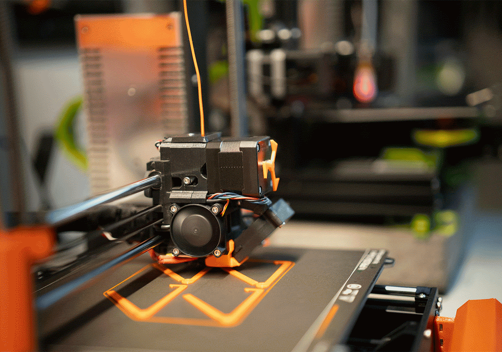

# <p align="center">**FABMATCH**</p>



The **FABMATCH** project is a 🖥️ digital platform that serves as a mediator between 🖨️ 3D printer owners, 🏗️ specialized 3D designers, and end-users, aimed at supporting students and innovators. It is built using modern technologies like **⚛️ React** and **⚡ Vite** to provide a seamless and fast experience.

---
gggggggg
## Contributors

| Name                 | Role               | Contact              | LinkedIn                             |
|----------------------|--------------------|----------------------|--------------------------------------|
| Fahad Alghamdi       | Founder / Developer | 📧 fahad@example.com    | [🔗 Fahad Alghamdi](https://www.linkedin.com/in/fahad-alghamdi-a91969246/) |
| Saad Alquhaiz        | Founder / Developer  | 📧 saad@example.com     | [🔗 Saad Alquhaiz](https://www.linkedin.com/in/saad-alquhaiz-a2988726b/)   |
| Abdullah Aldosari    | Founder / Developer | 📧 abdullah.m.a442@gmail.com | [🔗 Abdullah Aldosari](https://www.linkedin.com/in/abdullah-al-dossary-679a07259/) |
| Abdulaziz Albudrani  | Founder / Developer  | 📧 abdulaziz@example.com | [🔗 Abdulaziz Albudrani](https://linkedin.com/in/abdulaziz-albudrani) |

---

## Project Description

FABMATCH is an innovative platform designed to bridge the gap between 3D printing enthusiasts, designers, and end users. Our goal is to create a seamless experience that connects 3D printer owners with talented 3D designers, enabling efficient collaboration and problem-solving.

Through FABMATCH, we aim to address common challenges in the 3D printing and design industries by:
1. Providing a user-friendly interface for matching designers with 3D printer owners.
2. Helping end users access tailored 3D printed solutions for their unique needs.
3. Encouraging collaboration to optimize designs and reduce production errors.
4. Empowering the 3D printing community with a reliable and efficient platform.

Whether you're a designer, a 3D printer owner, or someone seeking customized 3D printed products, FABMATCH is here to connect and support you.

---

## Prerequisites

To run the project, make sure you have the following tools installed on your device:

- **Node.js** (version 14 or later).
- **npm** or **yarn** for package installation and management.

---

## Installation Steps

1. Clone the project repository:
   ```bash
   git clone https://github.com/your-username/repository-name.git
   cd repository-name
   ```

2. Install the required packages:
   ```bash
   npm install
   ```

3. Run the development server:
   ```bash
   npm run dev
   ```

---

## 🛠️ Tools and Technologies Used

- ⚛️ **React**: A JavaScript library for building user interfaces.
- ⚡ **Vite**: A modern and fast build tool for web projects.
- 🎨 **CSS**: For styling and designing the user interface.

---

